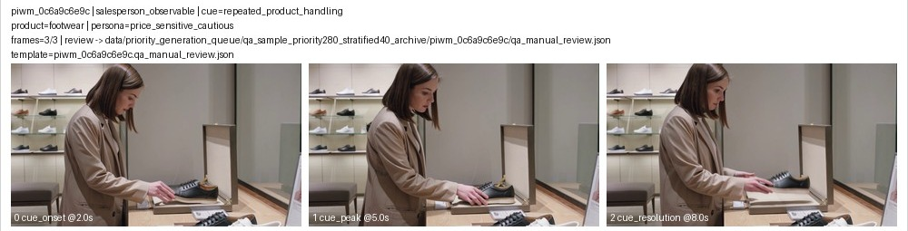

# PIWM Before / After Demo Examples

更新时间：2026-05-01 22:50 CST

这份文档回答 lead 提的问题：

> 怎么看出来有效果提升？有没有同一个输入下，训练前和训练后的输出对比？

结论先说：

- 最直观的 demo 不是只看总表，而是看**同一段顾客画面、同一个问题**下，未训练模型和 PIWM 训练后模型分别输出什么。
- 训练前模型经常自由发挥，输出不符合 PIWM 的固定格式，也会漏掉候选动作和风险收益字段。
- 训练后模型能稳定按 PIWM 结构输出：当前状态、候选动作、动作后果、风险、收益、奖励分数。
- 但要注意：**训练后 raw output 是给系统解析的内部格式，不是面向用户的最终话术**。它的自然语言质量仍然一般，尤其 BDI 文本偏模板化。

## 先讲清楚：这个 demo 证明什么，不证明什么

这个 demo 证明：

- 训练让模型从“自由描述图片”变成“能输出可解析的导购决策状态”。
- 训练后模型能使用 PIWM 的固定动作集合，而不是随便写 `offer-help`、`ask-question` 这种自由文本。
- 训练后模型能把动作后果写成结构化字段，例如风险、收益、奖励分数。

这个 demo **不证明**：

- 模型已经能写出高质量自然语言解释。
- 模型的 BDI 文本已经细腻、真实、像专业导购分析。
- 模型可以直接把 raw output 展示给终端用户。

因此给 lead 展示时，应把 raw output 叫做：

```text
模型内部结构化输出
```

不要叫：

```text
最终用户可读回答
```

## Demo 1：同一段顾客画面，训练前后如何判断当前状态

输入画面：顾客在鞋类货架前反复触摸/测试同一件商品。



样本 ID：`piwm_0c6a9c6e9c`

标准答案：

```text
顾客阶段：interest
顾客心理：价格敏感且谨慎，仍在比较
主动介入强度：3
候选导购动作：
- A4_open_with_question
- A5_provide_demonstration
- A1_silent_observe
- A3_strong_recommend
```

训练前模型真实输出：

```text
stage: interest
belief: The customer is considering purchasing a shoe.
desire: The customer wants to try on the shoe.
intention: The customer intends to pick up the shoe.
score: 2
cands: offer-help, ask-question
```

这个回复能看出未训练模型“看懂了一点画面”，但问题是：

- 没有使用 PIWM 要求的 XML 标签格式，例如 `<stage>...</stage>`。
- `score` 给成了 `2`，标准答案是 `3`。
- 候选动作写成了自由文本 `offer-help, ask-question`，不是 PIWM 的动作集合。
- 因此系统无法把它接到后续导购决策模块里。

训练后模型输出：

```text
当前判断：
顾客处在兴趣/评估阶段，正在反复测试商品，还没有进入最终购买决策。

介入强度：
3 / 5，适合温和介入，不适合立刻强推。

可考虑的导购动作：
1. 开放式询问：先问顾客关注点，例如尺码、舒适度或价格。
2. 产品演示：主动展示商品细节，帮助顾客完成比较。
3. 继续观察：如果顾客仍在专注测试，可以短暂等待。
4. 强推荐：仅作为对照候选，后续风险评估会判断它是否合适。
```

这个 demo 能说明的提升：

| 对比点 | 训练前 | 训练后 |
|---|---|---|
| 是否按固定格式回答 | 否，使用自由格式 | 是 |
| 是否能给出顾客阶段 | 部分正确：`interest` | 正确：`interest` |
| 是否能给出主动介入强度 | 不准确：`2` | 正确：`3` |
| 是否能列出可执行导购动作 | 否，给出自由文本动作 | 是：4 个 PIWM 候选动作 |

对外解释：

> 同一段顾客画面下，未训练模型能做一些普通描述，但不能进入 PIWM 的导购决策格式；训练后模型能把画面转成可执行的导购状态和候选动作。

## Demo 2：同一段顾客画面 + 同一个动作，训练前后如何预测动作后果

同一段输入画面：`piwm_0c6a9c6e9c`

给定导购动作：

```text
A3_strong_recommend
```

含义：导购比较强势地推荐某一件商品。

标准答案：

```text
下一阶段：attention
顾客心理：觉得导购压力太大
风险：medium
收益：low
奖励分数：-0.30
```

训练前模型真实输出：

```text
<next_stage>action</next_stage>
<next_belief>low</next_belief>
<next_desire>medium</next_desire>
<next_intention>high</next_intention>
<risk>low</risk>
<benefit>medium</benefit>
<reward>0.50</reward>
```

这个回复的问题是：它虽然有标签格式，但把心理字段写成了 `low / medium / high` 这种风险等级，说明未训练模型混淆了“心理状态描述”和“风险收益等级”；同时它把后果判断得过于乐观。

训练后模型输出：

```text
如果此时强势推荐，系统预测顾客可能感到压力，互动意愿会下降。

动作后果：
- 顾客阶段可能退回到更低意愿状态。
- 顾客可能回避进一步交流，甚至倾向离开。
- 风险：中等。
- 收益：较低。
- 综合奖励：-0.30。

结论：
这个动作不应作为首选，更适合选择开放式询问或产品演示。
```

这段比 Demo 1 更适合展示，因为它清楚体现了训练前后的判断差异：

- 训练前把强推荐判断成低风险、正收益。
- 训练后把强推荐判断成中风险、低收益、负奖励。

这个 demo 能说明的提升：

| 对比点 | 训练前 | 训练后 |
|---|---|---|
| 是否能解析动作后果 | 能解析，但语义错位 | 是 |
| 是否判断强推有风险 | 否，给成 `low` | 是：`medium` |
| 是否判断收益低 | 否，给成 `medium` | 是：`low` |
| 是否给出负向奖励 | 否，给成 `0.50` | 是：`-0.30` |

对外解释：

> 训练前模型容易把强推理解成仍然有正收益；训练后模型能学到：对谨慎/价格敏感顾客强推可能带来压力、回避和负向奖励。

## Demo 3：同一段当前画面，加入后续反应画面后，模型判断更好

这个 demo 用来解释 World Model 部分。

任务不是让模型生成未来视频，而是给模型：

```text
当前顾客画面 + 导购动作 + 一段后续反应画面
```

让模型判断：

```text
这段后续反应是否符合这个动作的合理后果？
```

当前评估结果：

| 输入设置 | 判断动作-后果是否匹配 |
|---|---:|
| 只看当前顾客画面 | 48.8% |
| 加入后续反应画面 | 59.5% |

对外解释：

> 后续反应画面提供了额外信息。模型看到“顾客后退、收手、回避视线”等反应后，更容易判断某个导购动作是否导致了合理后果。

## 给 lead 的展示顺序建议

建议演示时不要先讲模型结构，直接按下面顺序：

1. 先放 Demo 1：同一张/同一组三帧图，训练前是自由文本动作，训练后是可解析的 PIWM 状态和候选动作。
2. 再放 Demo 2：同一输入加同一个导购动作，训练前误判强推为正收益，训练后能输出风险、低收益和负奖励。
3. 最后放 Demo 3：展示 World Model 不是“凭空生成未来”，而是用后续反应画面验证动作后果是否合理。

一句话总结：

> 效果提升不是“训练后 raw 文本更漂亮”，而是同一输入下，训练前模型自由发挥、动作不可执行；训练后模型能输出可解析的导购状态、候选动作和动作后果。最终展示给人的自然语言需要再由这些结构化字段渲染。

## 当前 demo 暴露的真实短板

这个 demo 也暴露了当前模型的短板：

| 短板 | 现象 | 后续修法 |
|---|---|---|
| BDI 文本模板化 | 输出里直接出现 `Persona: ...` | 下一版训练目标去掉模板痕迹，改成更自然的心理描述 |
| 视觉证据不够细 | `obtain a better price` 更像人设推断，不完全来自画面 | 在 perception 输出里加入更细的 visual cue profile |
| raw output 不适合给用户看 | XML 标签对系统有用，但对人不友好 | 增加 deterministic renderer，把结构化字段转成人类可读解释 |
| 最终动作选择仍弱 | 端到端 best action 仍未提升 | 单独修 action-selection prompt / parser / 训练数据 |

## 记录来源

- Demo 1 的训练前输出：用同一 base 模型、同一输入样本单条重跑得到。原因是早期批量评估文件对 parse-fail perception 样本只保存了错误类型，没有保存原始回复。
- Demo 1 的训练后输出：来自 `data/piwm_results/main_table_piwm_sft_priority1000_current_len8192_priority40_all.json`。
- Demo 2 的训练前和训练后输出：均来自同一主评估 JSON 文件中的落盘 prediction。
