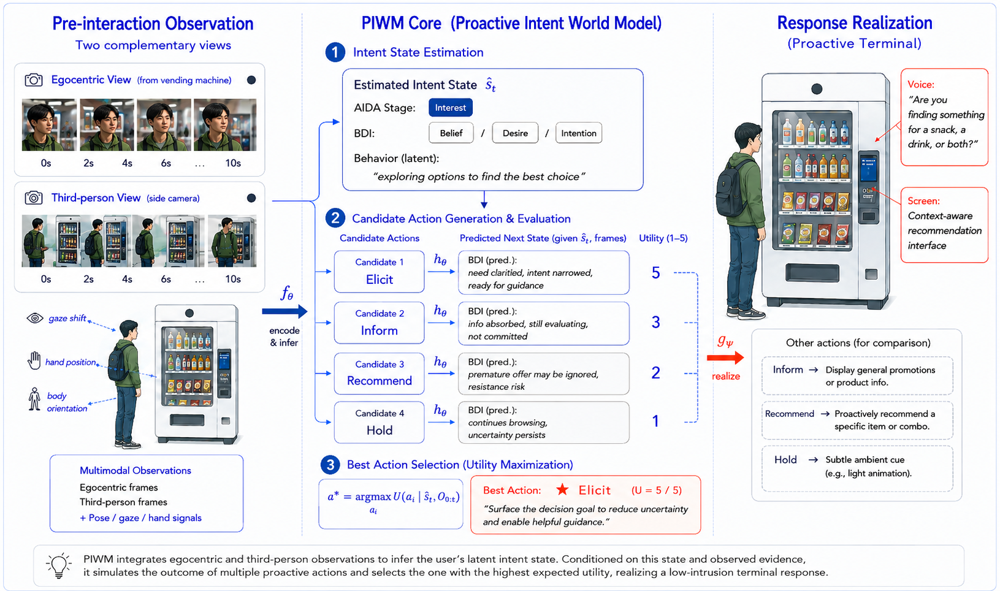

# Proactive Intent World Model (PIWM)

PIWM 是一个零售设备前置摄像头视角下的顾客状态与动作偏好标注数据集，配套合成视频生成流水线。



```text
seed → manifest → prompt → video
seed → manifest → labeled → sft
```

## Data

| Layer | Count | Range |
|---|---:|---|
| seed | 200 | piwm_001 – piwm_200 |
| manifest | 200 | piwm_001 – piwm_200 |
| labeled | 200 | piwm_001 – piwm_200 |
| prompts | 200 | piwm_001 – piwm_200 |
| video | 149 | piwm_001–138, piwm_149–159 |

归档批次（video-pending）：`piwm_1001 – piwm_1118`，共 118 条，不参与当前训练流程。

## Directory

```text
data/
  seed/           场景初始条件（自然语言）
  manifest/       顾客状态结构化描述
  labeled/        候选动作、outcome 与 best_action
  prompts/        视频生成 prompt
  videos/
    synth/        Kling 合成视频
    real/         真实拍摄视频
  eval/
    real/         真实视频评测集
  train/          SFT 训练 JSONL（ms-swift 格式）

script/
  gen_manifest.py       seed → manifest
  gen_deliberation.py   manifest → labeled
  gen_prompt.py         manifest → prompt
  gen_video.py          prompt → video（Kling API）
  gen_sft.py            labeled → SFT JSONL
  gen_scores.py         labeled 补充 LLM 1-5 score
  check_quality.py      全量数据质量检查

docs/
  index.md        数据状态与分布统计
  design.md       任务设定、状态模型、动作空间
  schema.md       字段契约与 preference score 公式
  training.md     两阶段 SFT 设计
  usage.md        完整流程与脚本用法
```

---

## Quick Start

```bash
pip install openai requests
export OPENAI_API_KEY=...
```

```bash
# 单条生成
python script/gen_manifest.py "desire 阶段，中等犹豫，价格敏感" --id piwm_201
python script/gen_prompt.py data/manifest/piwm_201.json
python script/gen_deliberation.py data/manifest/piwm_201.json
python script/gen_video.py data/prompts/piwm_201.md

# 批量补全（跳过已有）
python script/gen_video.py

# 质量检查
python script/check_quality.py

# 生成 SFT 数据
python script/gen_sft.py
```

Docs: [docs/index.md](docs/index.md) · [docs/design.md](docs/design.md) · [docs/schema.md](docs/schema.md) · [docs/usage.md](docs/usage.md) · [docs/training.md](docs/training.md)
